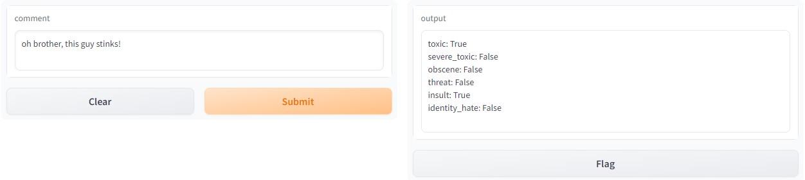

# Comment toxicity

A NLP model that classifies a sentence into 5 degress of toxicity. The model uses bidirectional-LSTM, and several feed-forward neural network layers to finally classify the sentence into the degrees of toxicity.

> **Note** : A raw sentence can't be passed through the model yet. The preprocessing layer has to be a vectorizer. The vectorizer used for this experiment, was trained on the [Kaggle competition data](https://www.kaggle.com/competitions/jigsaw-toxic-comment-classification-challenge)

